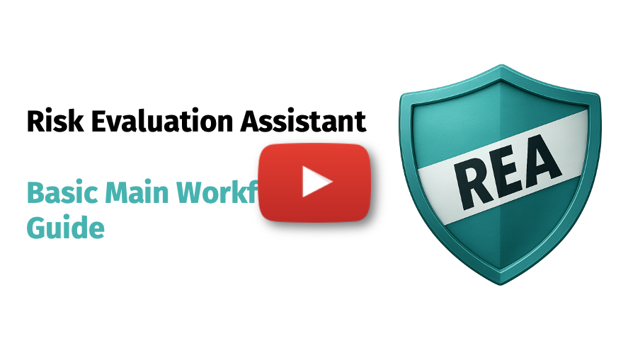
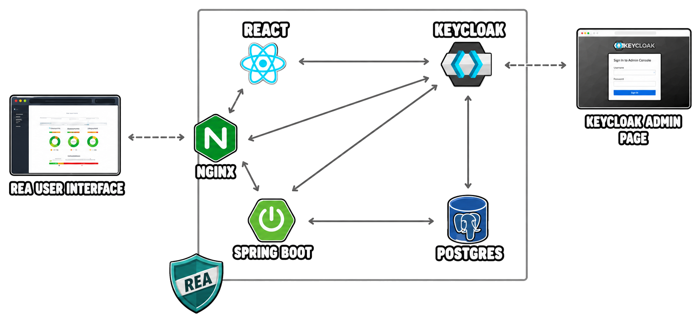

# Risk Evaluation Assistant (REA)

**REA (Risk Evaluation Assistant)** is an open-source decision-support tool designed for non-technical users to operationalize **risk-based anonymization**. It provides a structured workflow to help data custodians determine safe parameters for sharing data.

REA performs a **qualitative attribute-level review**, classifying variables by Replicability, Availability, and Distinguishability to identify quasi-identifiers and assess attribute Sensitivity. It then models the **data release context** by assessing three key factors: Invasion of Privacy, Mitigating Controls, and the Recipient’s Motives and Capacity. Finally, REA translates these qualitative assessments into actionable quantitative metrics:

- **Probability of Attack:** Estimated based on the strength of security controls and recipient capacity.
- **Recommended Anonymization Threshold:** Defines the maximum permissible data risk for the specific scenario.

Together, these outputs allow users to configure anonymization engines by specifying exactly which variables require protection and defining the appropriate risk parameters.

## Main Workflow

This video provides a comprehensive walkthrough of the REA main workflow.

[](https://www.youtube.com/watch?v=KaFIxCkTF4I)

## Architecture

REA is implemented as a three-tier, containerized web application orchestrated with 🐳 **Docker Compose**. Incoming requests are managed by a reverse proxy using 🌐 **Nginx** (exposing ports 80 and 443), which serves the ⚛️ **React** frontend and proxies API calls to the 🌱 **Spring Boot** backend. Authentication and authorization are centrally managed via OpenID Connect with 🔑 **Keycloak**. The React SPA obtains tokens from Keycloak and presents them to the API, where Spring Security validates them. All application data persist in an 🐘 **PostgreSQL** database.



<br />

## Configurations

This section outlines the basic configurations available for the application. Docker Compose uses one environment file to configure Keycloak, Nginx, PostgreSQL, and the Spring Boot backend.

- **Local (`.env.local`)**: Uses `KC_REALM_FILE=realm-config-local.json` to import the localhost Keycloak realm and enables backend sample data through setup variables such as `APP_SETUP_LOAD_SAMPLE_DATA`.
- **Production (`.env.prod`)**: Treat this file as a template. Before deployment, configure the production Keycloak realm, TLS certificates, and Nginx reverse-proxy settings for your domain.

### 🔐 Keycloak

Keycloak provides OpenID Connect authentication and authorization. The imported realm must define the clients and roles required by REA.

The repository also includes `rea-theme/`, a custom Keycloak login theme. Docker Compose mounts it into Keycloak, and the imported realm configures it as the login theme.

#### Application Roles

REA uses two application roles:

- **Admin (`ROLE_ADMIN`)**: Can manage risk configurations and override normal access restrictions, including ownership, sharing, and locking rules.
- **Simple user (`ROLE_USER`)**: Can work with assigned or shared datasets, recipients, assessments, and data-sharing activities, but cannot change global configurations or override other users' work.

### 🌱 Backend - Spring Boot

On application startup, two loaders initialize the database:

1. **ConfigLoader**: Imports complete risk configuration objects from JSON files in `backend/src/main/resources/data/`. Each JSON file represents one framework and contains its categories, questions, options, risk bands, risk matrix, and re-identification thresholds.

2. **DataLoader**: Inserts backend sample data (datasets, recipients, and their assessments) for testing purposes.

<br />

## 🚀 Start Application

### 1. Prerequisites

Ensure you have installed **Docker & Docker Compose** (Engine ≥ 19.03, Compose ≥ 1.25) on your machine.

### 2. Clone the Repository

```bash
git clone https://github.com/BIH-MI/risk-evaluation-assistant.git
cd risk-evaluation-assistant
```

### 3. Run the Application Locally

```bash
# Start using the local environment file
docker-compose --env-file .env.local up -d --build
```

Once the containers are ready, open `http://localhost`.

The local realm provides these demo accounts:

| Role | Username | Password |
| --- | --- | --- |
| Admin | `admin` | `admin` |
| Simple user | `user` | `password` |

These credentials are for local development only. The full list of imported local users is defined in `keycloak/realm-config-local.json`.

## Developer Guides

- [Frontend guide](./frontend/README.md)
- [Backend guide](./backend/README.md)

<br />
<br />

## Acknowledgments

- This project uses components from [Material Dashboard React](https://github.com/creativetimofficial/material-dashboard-react), which is licensed under the MIT License.  
  See [`third-party/material-dashboard-react_LICENSE.md`](third-party/material-dashboard-react_LICENSE.md) for the full license text.

## License

This project is licensed under the MIT License. See the full text in [LICENSE.md](./LICENSE.md).

## How to Cite

If you use REA in academic or scientific work, please cite the project and link to this repository.
